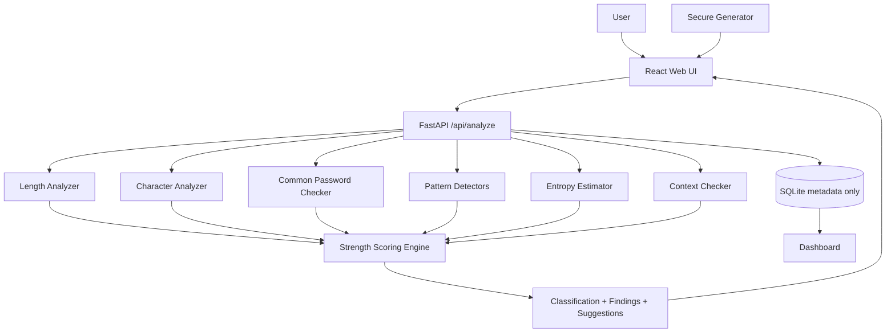
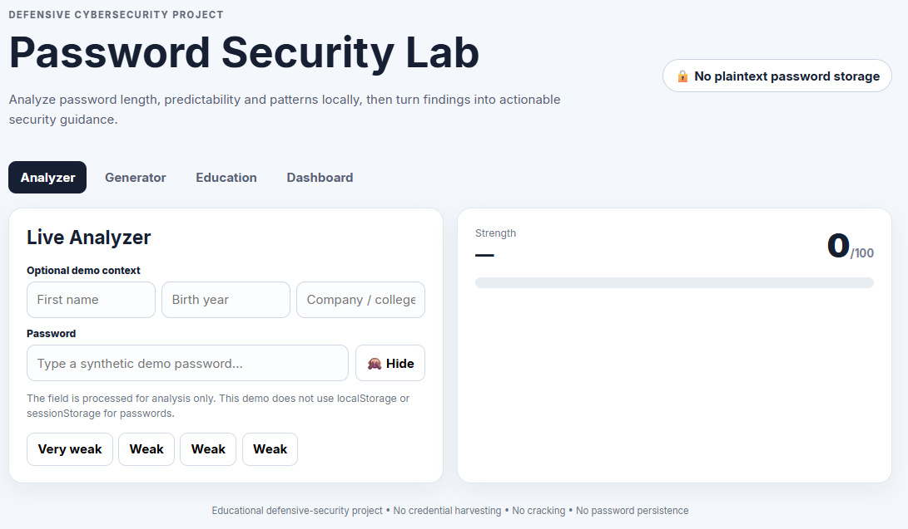
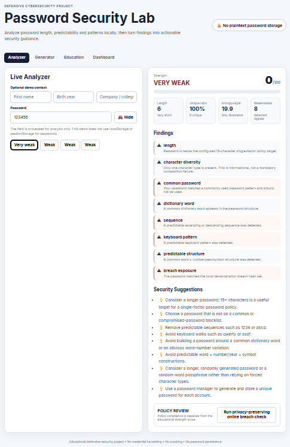
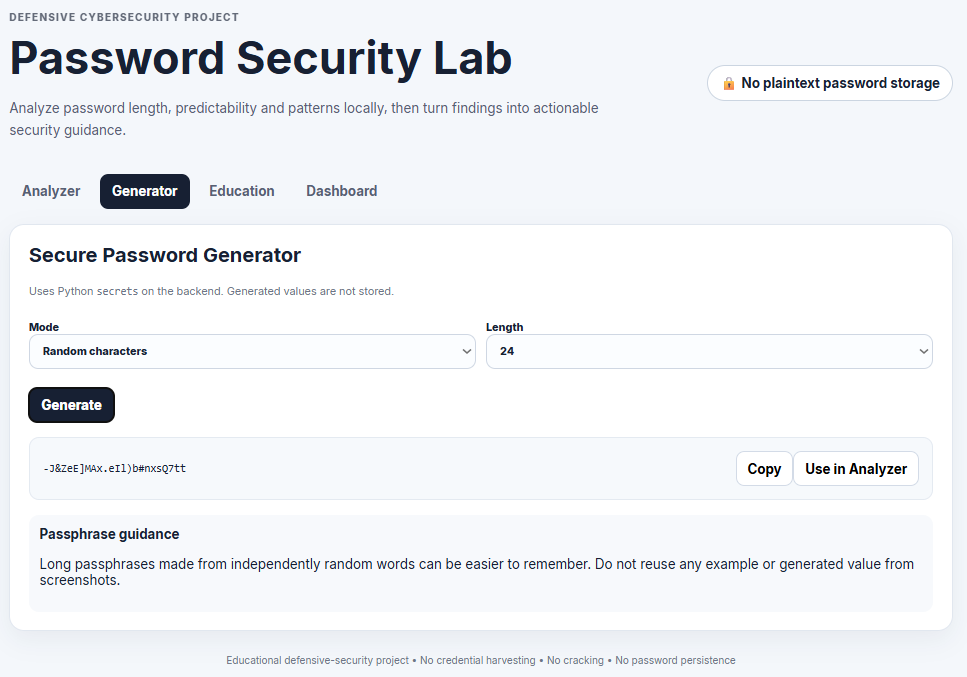
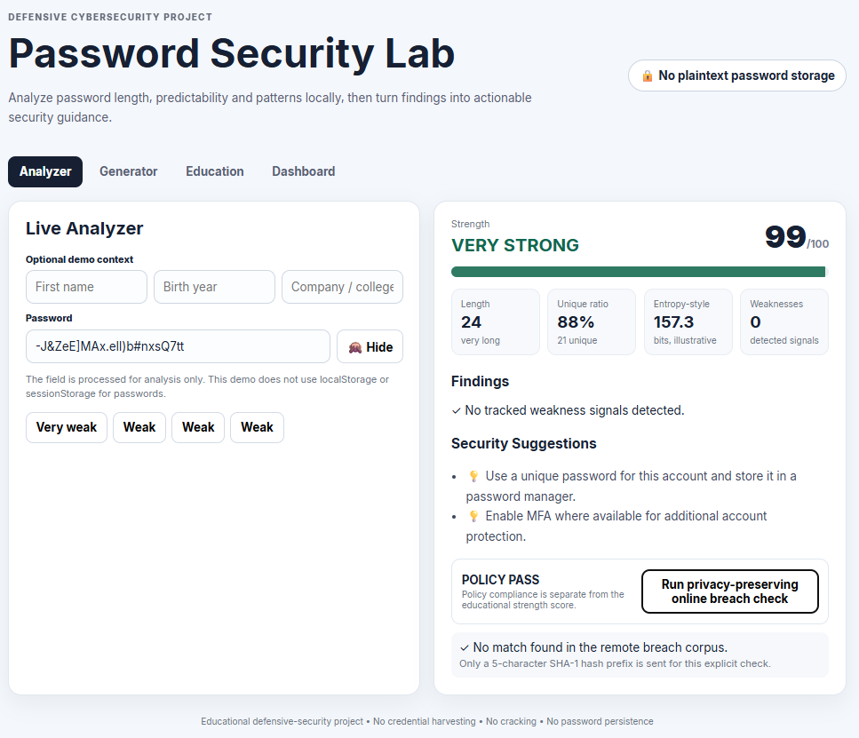
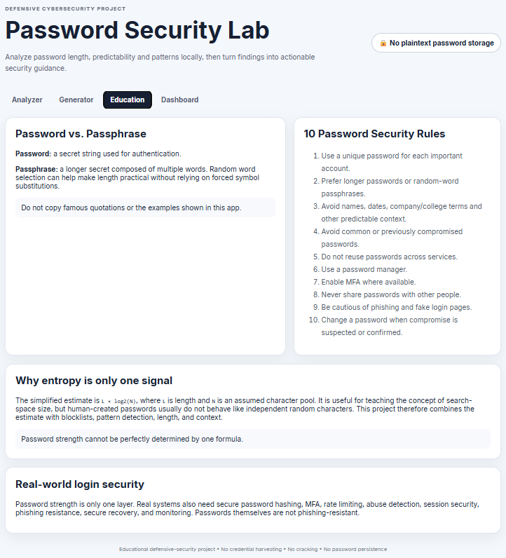
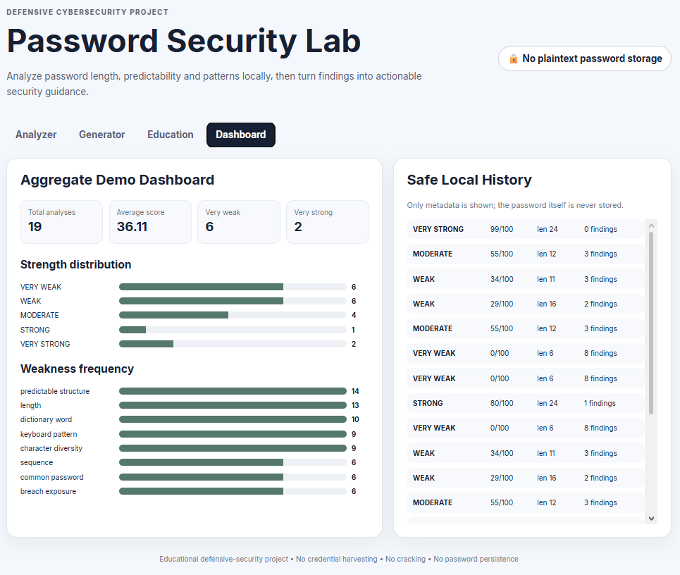

# Password Strength Analyzer & Security Suggestion Tool

Privacy-focused cybersecurity coursework project for evaluating password strength using length, predictability, common-password checks, pattern analysis, entropy concepts, policy guidance, and actionable recommendations.

> **Safety design:** passwords are processed transiently, are not written to application logs, are not stored in the analytics database, and are not sent to external breach services by default. Screenshots/tests use synthetic demo passwords only.

## Overview

The project demonstrates how a password meter can move beyond simplistic “uppercase + lowercase + number + symbol” rules. The analyzer combines length, character diversity, unique-character ratio, common-password matching, dictionary-word signals, keyboard walks, sequences, repetition, predictable word-number/year structures, optional user-supplied context, and an illustrative entropy calculation.

The 0–100 score and its five classification bands are **project-defined educational heuristics**, not universal security standards.

## Why this matters

Current NIST SP 800-63B-4 guidance says passwords used as a single factor should be at least 15 characters, verifiers should permit at least 64 characters, should not impose composition rules, and should not require periodic password changes. It also requires comparison against a blocklist of commonly used, expected, or compromised values.

OWASP similarly emphasizes password length, blocklists, meaningful feedback, rate limiting, TLS, and password managers rather than composition-only rules. citeturn896008search1

## Features

- Real-time strength meter
- 0–100 educational score + VERY WEAK / WEAK / MODERATE / STRONG / VERY STRONG
- Length analysis
- Character diversity and unique-character ratio
- Local common-password blocklist
- Dictionary/common-word detection
- Ascending/descending sequence detection
- Keyboard-pattern detection
- Repetition and repeated-substring detection
- Predictable word + number/year/symbol detection
- Date-like and phone-like pattern warnings
- Optional personal-context overlap check
- Theoretical entropy-style estimate with limitations
- Separate configurable policy checker
- Secure generator using Python `secrets`
- Passphrase education and demo generator
- Privacy-safe SQLite analytics
- Aggregate dashboard
- Automated security/privacy tests
- Standalone Argon2id hashing demonstration using synthetic data
- Optional explicit online Pwned Passwords k-anonymity check

## Architecture



## Technology Stack

### Recommended student implementation

- Python 3.10+
- FastAPI + Uvicorn
- Pydantic
- React + Vite
- SQLite (metadata only)
- Chart.js / lightweight CSS-based dashboard visualizations
- pytest
- argon2-cffi for the separate storage demonstration

### Why FastAPI + React?

It gives a clear API boundary, typed request validation, a modern frontend, and a realistic structure for demonstrating backend security and frontend privacy controls. Flask + HTML/CSS/JavaScript is simpler for a first Python web app; this repository chooses FastAPI + React because the project specification explicitly asks for a modern architecture.

## Installation

### 1. Clone

```powershell
git clone <repository-url>
cd Password-Strength-Analyzer-Security-Tool
```

### 2. Backend environment

```powershell
py -3.10 -m venv .venv
.venv\Scripts\Activate.ps1
python -m pip install --upgrade pip
pip install -r requirements.txt
```

### 3. Start FastAPI

```powershell
uvicorn backend.app:app --reload --host 127.0.0.1 --port 8000
```

Open API docs at `http://127.0.0.1:8000/docs`.

### 4. Start React

Open a second terminal:

```powershell
cd frontend
npm install
npm run dev
```

Open the URL Vite prints, normally `http://localhost:5173`.

## Screenshots

### Password analysis



### Very weak password example



### Secure password generator



### Strong password example



### Education page



### Dashboard page



## Usage

Use synthetic demo values such as:

- `123456`
- `Password123!`
- `aaaaaaaaaaaaaaaa`
- `qwerty2026!`
- a freshly generated 20-character value from the application

Do not use a real password in screenshots, issues, demos, or the repository.

## API Documentation

### POST `/api/analyze`

Request:

```json
{
  "password": "<processed transiently>",
  "context": {
    "first_name": "Rahul",
    "birth_year": "2001",
    "company_or_college": "Demo College"
  },
  "check_local_breach": true
}
```

Response never contains the submitted password. It returns score, classification, findings, suggestions, metrics, policy results, and a local-demo breach status.

### POST `/api/generate`

Supports `complex` and `passphrase` modes. The generator uses Python `secrets`, not `random`.

### POST `/api/breach-check`

Optional explicit remote check. This endpoint is **not used by the real-time meter**. It sends only the first five SHA-1 hash characters to the Pwned Passwords range service, then compares the returned suffixes locally. HIBP documents this k-anonymity design.

### GET `/api/dashboard/stats`

Returns aggregate metadata only.

## Scoring Model

| Signal | Maximum contribution |
|---|---:|
| Length | 35 |
| Character diversity | 15 |
| Unique-character ratio | 10 |
| Pattern resistance | 20 |
| Not an exact common password | 10 |
| Additional unpredictability | 10 |
| **Maximum** | **100** |

Penalties are then applied for common-password matches, keyboard patterns, sequences, repetition, dictionary words, personal-context overlap, date-like data, phone-like data, and predictable structures.

The model is intentionally transparent and explainable. It does **not** claim to calculate an objective universal “strength.” NIST notes that estimating entropy for user-chosen passwords is challenging.

## Policy Checker

Default demo policy:

- Minimum length: 15
- Maximum supported length: 128
- Common-password check: enabled
- Personal-context check: enabled
- Spaces and Unicode: accepted by the API
- No periodic rotation requirement
- No mandatory uppercase/lowercase/number/symbol composition rule

The 15-character target reflects current NIST SP 800-63B-4 guidance for passwords used as a single authentication factor.

## Privacy Design

- No plaintext password database column exists.
- Passwords are not added to logs or exceptions.
- Passwords are not returned by the API.
- Passwords are not placed in URLs.
- The frontend does not use localStorage or sessionStorage for passwords.
- Analytics records only score, classification, length, unique-character ratio, weakness count, findings, and timestamp.
- Remote breach checks are disabled from real-time analysis and require an explicit action.
- Production deployment should use HTTPS/TLS and a distributed rate limiter.

OWASP recommends protecting password transmission with TLS, using strong password hashing, and protecting against automated attacks.

## Secure Password Storage Demonstration

The separate `backend/hash_demo.py` demonstrates Argon2id hashing and verification using a fixed synthetic password. It is intentionally disconnected from the analyzer and analytics database.

OWASP recommends dedicated password-hashing functions such as Argon2id, bcrypt, or PBKDF2 rather than fast general-purpose hashes for password storage.

## Testing

Run:

```powershell
pytest -q
```

The tests cover weak/common patterns, sequences, repetition, keyboard patterns, context overlap, Unicode, spaces, generator behavior, API privacy, database schema, logging, and policy/score boundaries.

## Security Testing

See [`docs/SECURITY_TESTING.md`](docs/SECURITY_TESTING.md) for a manual checklist covering:

- no password field in SQLite
- no password in logs
- no password in API response
- no password in URL parameters
- password input field type
- no localStorage/sessionStorage persistence
- metadata-only analytics

## Results

The project is designed to produce auditable findings such as:

- `123456` → very weak due to length, common-password match, numeric predictability and demo breach exposure
- `Password123!` → weak/moderate depending on the exact scoring signals, despite satisfying simple composition rules
- `aaaaaaaaaaaaaaaa` → weak because repetition offsets the benefit of length
- `qwerty2026!` → weak due to keyboard and predictable year/number structure
- a new random 20-character generator value → typically strong/very strong in this project’s heuristic model

## Limitations

- The score is not a universal security metric.
- The entropy-style estimate assumes a random character model and is optimistic for human-created passwords.
- The local blocklist is intentionally small for coursework.
- The local breach set is a tiny demonstration set, not a real breach corpus.
- Remote HIBP checking is optional and should not be called on every keystroke. HIBP specifically notes that incremental searching can leak enough metadata to observe the password search process, so a completed-password event is safer.
- The application does not attempt to model every attacker strategy.

## Future Improvements

- Integrate a mature password-strength estimator
- Larger audited blocklist
- Privacy-preserving enterprise breach corpus hosting
- Enterprise IAM/SSO integration concepts
- Password-manager browser UX
- MFA and passkey/WebAuthn awareness
- Localization and accessibility improvements
- Organization-level reporting with only aggregate statistics

## Screenshots

Suggested files are listed in [`docs/SCREENSHOT_CHECKLIST.md`](docs/SCREENSHOT_CHECKLIST.md).

## Learning Outcomes

This project demonstrates Python, FastAPI, React, REST API design, secure randomness, privacy-by-design, password security concepts, SQLite analytics, testing, secure coding, IAM concepts, and cybersecurity documentation.

## References

- NIST SP 800-63B-4: https://pages.nist.gov/800-63-4/sp800-63b.html
- OWASP Authentication Cheat Sheet: https://cheatsheetseries.owasp.org/cheatsheets/Authentication_Cheat_Sheet.html
- OWASP Password Storage Cheat Sheet: https://cheatsheetseries.owasp.org/cheatsheets/Password_Storage_Cheat_Sheet.html
- Have I Been Pwned Pwned Passwords API: https://haveibeenpwned.com/API/v3

## Security Disclaimer

This is an educational defensive-security project. Do not submit production credentials or sensitive information to the demonstration deployment. The project does not crack passwords, attempt logins, or collect credentials.

## Author

Student Cybersecurity / Cloud / Application Security Project
